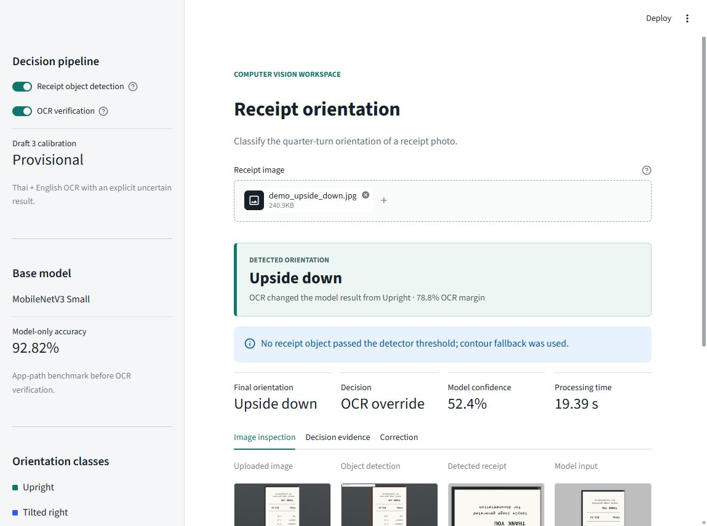
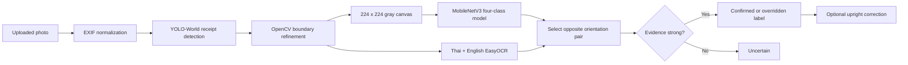

# Receipt Orientation Classifier

A computer vision project that detects a receipt in a photograph and classifies its observed quarter-turn orientation:

| Class | Clockwise angle from upright | Meaning |
| --- | ---: | --- |
| `upright` | 315-360 or 0-45 degrees | Text reads from top to bottom |
| `tilted_right` | 45-135 degrees | Receipt top points right |
| `upside_down` | 135-225 degrees | Receipt is inverted |
| `tilted_left` | 225-315 degrees | Receipt top points left |

The deployed application combines object detection, OpenCV receipt extraction, a MobileNetV3 image classifier, and Thai/English OCR verification. It also shows the evidence behind each decision and can return a corrected upright receipt.

> The receipt dataset is intentionally excluded from this repository. The selected classifier and detector weights are included so the app can run without the training images.



## Pipeline



The classifier chooses the likely axis first: vertical (`upright`/`upside_down`) or horizontal (`tilted_right`/`tilted_left`). OCR then compares only the two opposite directions on that axis. This addresses the visual symmetry that caused the base model to confuse upright with upside down and left with right.

When the model is at least 95% confident with an 80-point probability margin, a matching OCR direction may confirm the label with an OCR score of at least 2.0 and a relative margin of at least 0.50. This targeted guardrail prevents a low absolute OCR score from forcing `Uncertain` when both systems strongly agree; weak OCR still cannot override a disagreeing model.

## Results

| Evaluation | Model only | OCR only within model pair | Hybrid |
| --- | ---: | ---: | ---: |
| Validation, 360 generated samples | 92.50% | 96.94% | **97.22%** |
| Test, 348 generated samples | 92.82% | 96.26% | **98.28%** |

The test split is grouped by physical source receipt, so rotated variants of one receipt cannot cross into another split. These scores measure the generated receipt domain, not unrestricted real-world performance.

Two upside-down Thai photographs of one physical receipt were reserved as an external regression check. The base model predicted both as upright; OCR overrode both to upside down. This is useful evidence that the failure was fixed, but two photos of one receipt are not an accuracy estimate.

See [Results and limitations](docs/RESULTS.md) and [Model card](MODEL_CARD.md) for the full interpretation.

## Public demo samples

The four images in `docs/assets` are generated, non-sensitive examples and are not part of the training dataset.

| Actual | Model output | Final hybrid output | Decision |
| --- | --- | --- | --- |
| Tilted left | Tilted right, 44.2% | **Tilted left** | OCR override |
| Tilted right | Tilted left, 41.8% | **Tilted right** | OCR override |
| Upright | Upright, 48.8% | **Upright** | OCR confirmed |
| Upside down | Upright, 52.4% | **Upside down** | OCR override |

The intentionally out-of-domain synthetic samples demonstrate why OCR verification is part of the final system. Exact OCR scores and timings are in [Sample predictions](docs/SAMPLE_PREDICTIONS.md).

## Repository structure

```text
.
|-- app.py                         Streamlit user interface
|-- config/                        Training and hybrid decision settings
|-- docs/                          Methodology, results, deployment, and samples
|-- models/
|   |-- detection/                 Receipt detector checkpoint
|   `-- trained/                   Selected orientation checkpoint
|-- reports/                       Reproducible aggregate metrics and charts
|-- scripts/                       Public demo and DOCX report generation
|-- src/                           Preprocessing, training, evaluation, and inference
|-- tests/                         Dataset-free unit and inference tests
|-- requirements.txt               Cloud/runtime dependencies
`-- requirements-training.txt      Additional experiment dependencies
```

Detailed responsibilities and command order are documented in [Code guide](docs/CODE_GUIDE.md).

## Run locally

Python 3.10 is the verified local and cloud runtime.

```powershell
python -m venv .venv
.\.venv\Scripts\Activate.ps1
python -m pip install --upgrade pip
python -m pip install -r requirements.txt
python -m streamlit run app.py
```

Open `http://localhost:8501`. The first OCR-enabled prediction downloads the missing EasyOCR Thai, English, and text-detection weights. Later predictions reuse the cached files.

To run the tests:

```powershell
python -m unittest discover -s tests -v
```

## Reproduce training

Install experiment-only packages:

```powershell
python -m pip install -r requirements-training.txt
```

Then provide the private/raw dataset locally and follow [Reproducibility](docs/REPRODUCIBILITY.md). At a high level:

```powershell
python src/prepare_dataset.py --source-dir <receipt-image-folder> --overwrite
python src/train_models.py --experiments simple_cnn_full simple_cnn_strict mobilenet_v3_small_finetune_full mobilenet_v3_small_finetune_strict
python src/evaluate_hybrid.py
```

Training generated 2,376 balanced samples from 198 unique source receipts. The selected checkpoint is MobileNetV3 Small with ImageNet initialization and partial fine-tuning.

## Cloud deployment

**Live app:** [receipt-orientation-cv-aung.streamlit.app](https://receipt-orientation-cv-aung.streamlit.app/)

The repository root contains `app.py`, `requirements.txt`, `packages.txt`, and `.streamlit/config.toml`, which is the layout used by Streamlit Community Cloud. Select Python 3.10 in the deployment's advanced settings. No secrets are required.

See [Deployment guide](docs/DEPLOYMENT.md) for build behavior, model caching, and troubleshooting.

## Documentation

- [Methodology](docs/METHODOLOGY.md)
- [Code guide](docs/CODE_GUIDE.md)
- [Reproducibility](docs/REPRODUCIBILITY.md)
- [Results and limitations](docs/RESULTS.md)
- [Sample predictions](docs/SAMPLE_PREDICTIONS.md)
- [Deployment guide](docs/DEPLOYMENT.md)
- [Model card](MODEL_CARD.md)
- [Full implementation report (DOCX)](docs/Receipt_Orientation_Classifier_Project_Report.docx)

## Privacy and intended use

Uploaded images are processed in application memory. The app code does not save uploads, but a hosting provider may apply its own operational logging and retention policies. Do not upload receipts containing information you are not authorized to process.

This is an educational orientation classifier, not a financial-document verification system. It does not validate totals, merchants, taxes, payment status, or authenticity.

## License

Code and included model artifacts are provided under the [MIT License](LICENSE). Verify that any dataset used for retraining has a compatible license and privacy basis.
