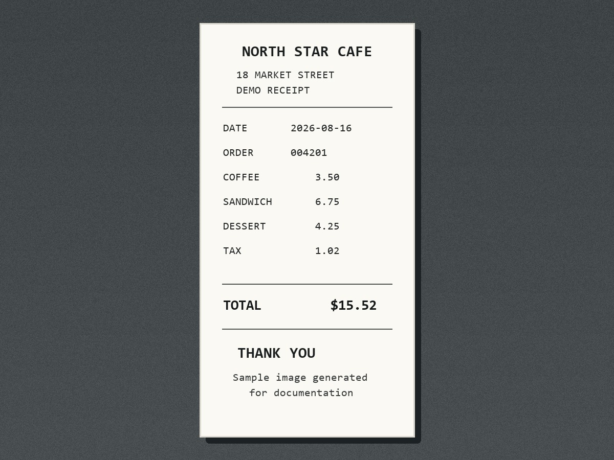
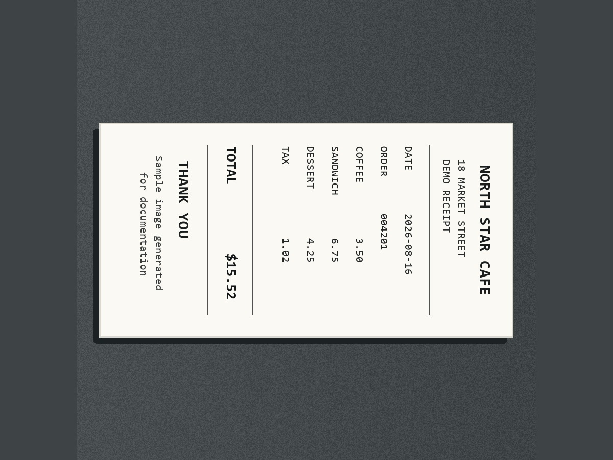
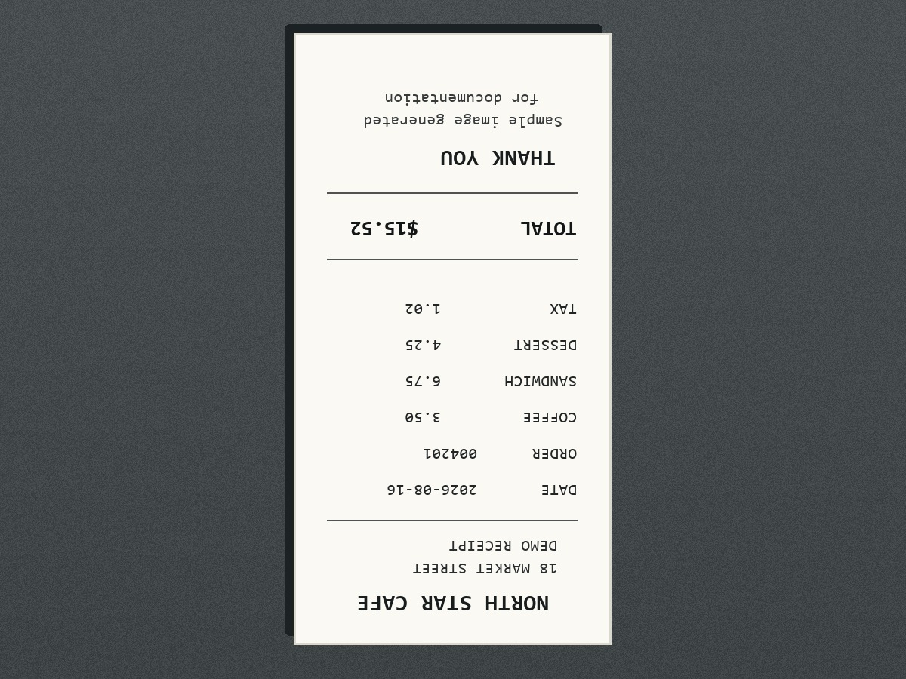
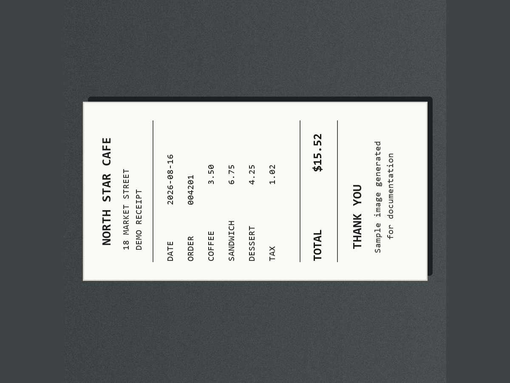

# Sample predictions

The images below are generated by `scripts/generate_demo_assets.py`. They contain fictional information and are not part of the receipt dataset or model training.

## Inputs

| Upright | Tilted right |
| --- | --- |
|  |  |

| Upside down | Tilted left |
| --- | --- |
|  |  |

## Full pipeline output

| Actual label | Base model | OCR choice | OCR score | OCR margin | Final label | Decision |
| --- | --- | --- | ---: | ---: | --- | --- |
| Tilted left | Tilted right, 44.2% | Tilted left | 125.70 | 78.9% | **Tilted left** | Override |
| Tilted right | Tilted left, 41.8% | Tilted right | 123.93 | 79.6% | **Tilted right** | Override |
| Upright | Upright, 48.8% | Upright | 120.27 | 80.0% | **Upright** | Confirmed |
| Upside down | Upright, 52.4% | Upside down | 127.79 | 78.8% | **Upside down** | Override |

CPU OCR time on the development machine ranged from 15.6 to 20.7 seconds per generated example after model initialization. Timings vary by hardware and should not be compared with model-only tensor inference.

## Interpretation

The base CNN sees a synthetic receipt style that was absent from training and has low confidence. It still chooses the correct vertical or horizontal pair for every sample. OCR then distinguishes the two opposite text directions and produces the correct final orientation.

This is the intended hybrid behavior:

- use visual classification to choose the axis;
- use readable text to determine the top side;
- override only when OCR evidence is strong;
- return uncertain instead of rotating when evidence is inadequate.
